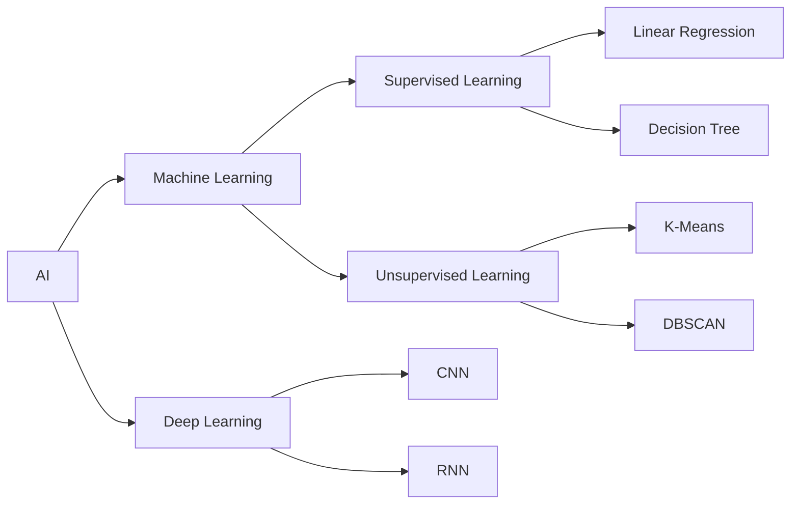

- 2范德萨规范
- 发多
- 测试修改

```mermaid
graph LR
    A[AI] --> B[Machine Learning]
    A --> C[Deep Learning]
    B --> D[Supervised Learning]
    B --> E[Unsupervised Learning]
    D --> F[Linear Regression]
    D --> G[Decision Tree]
    E --> H[K-Means]
    E --> I[DBSCAN]
    C --> J[CNN]
    C --> K[RNN]
```